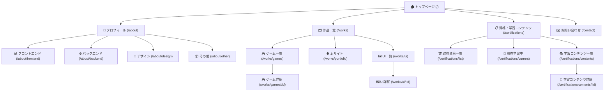
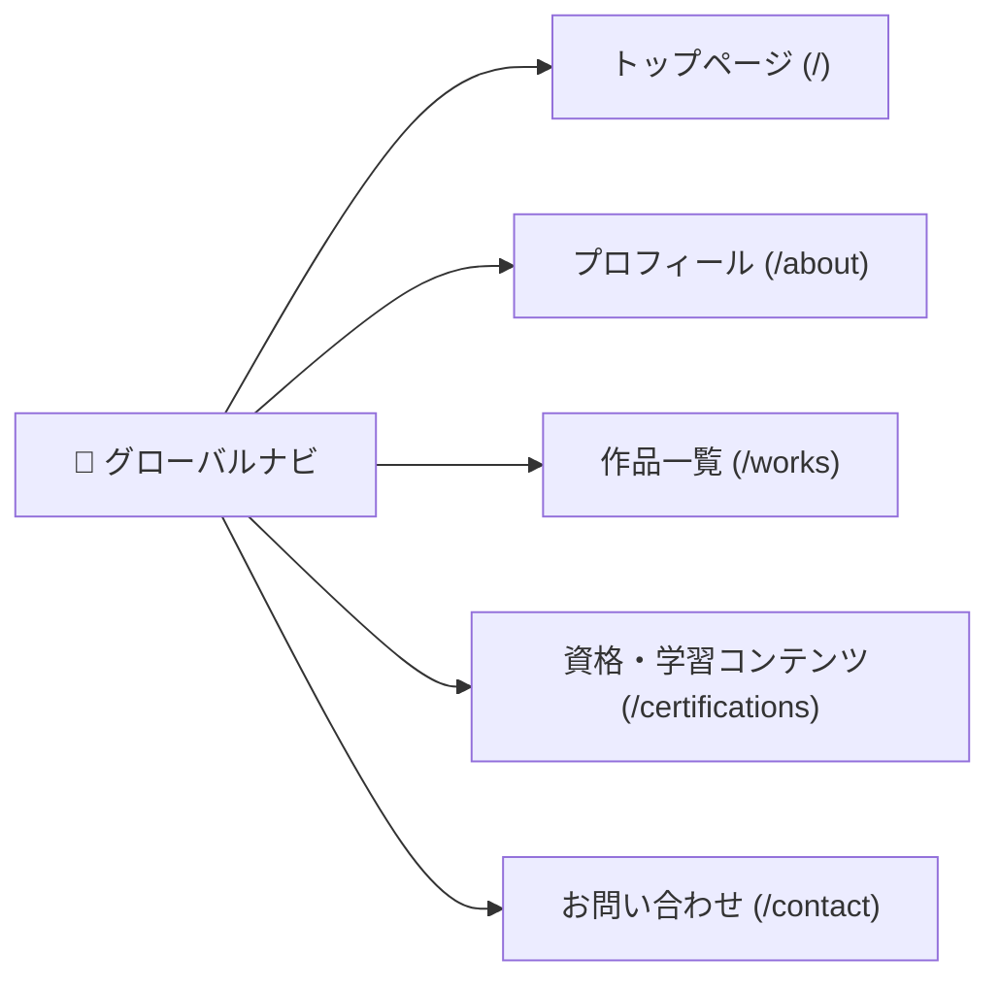
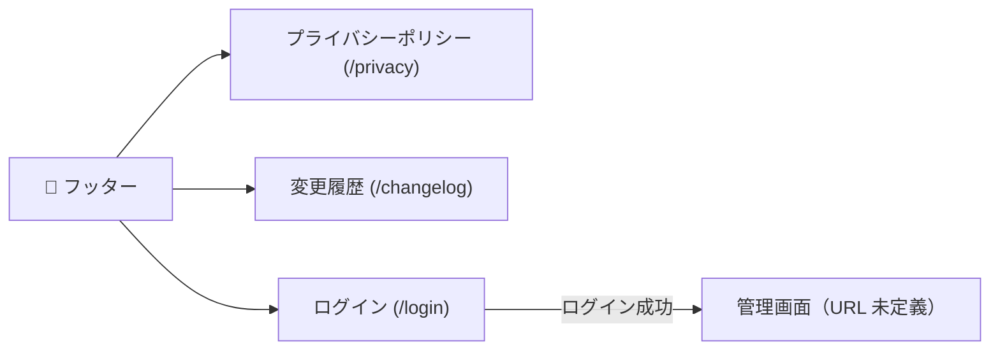

# 画面遷移図

ポートフォリオサイトの画面遷移図叩き台です（Mermaid 記法）。

---

## 画面遷移図

---

## グローバルナビゲーション

グローバルナビゲーションから任意のページへ直接遷移可能です。

---

## フッター導線

全ページのフッターから遷移可能なリンクです。ログインはグローバルナビには掲載しません。

---

## 備考・検討事項

- トップページには各セクションへのバナー・カードリンクを設ける
- 詳細ページには「一覧へ戻る」リンクを設ける。プロフィール詳細（P002-01〜04）には「プロフィールへ戻る」リンクを設ける
- 全ページにグローバルナビゲーションとフッターを配置する
- `/privacy`、`/changelog`、`/login` はグローバルナビ・メイン遷移図には含めず、フッター導線セクションで定義する
- プロフィール（P002）のスキルセットカードから各スキル詳細ページ（P002-01〜04）へ遷移する。準備中のカードはリンクを非表示とする
- ログイン（P008）はフッターからのみ遷移する。`/login` は検索エンジン向け sitemap からの除外・`noindex` を推奨
- ログイン成功後の管理画面 URL は別リポジトリで定義する（`01_DOCS/05_セキュリティ管理/00_概要.md` 参照）。定義後にフッター導線図を更新する
