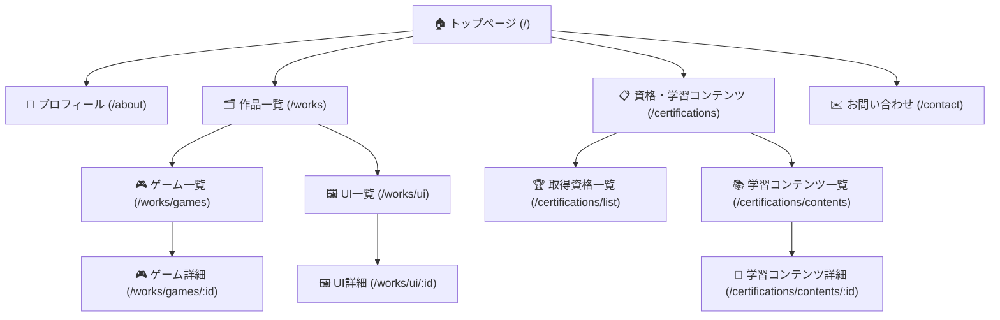
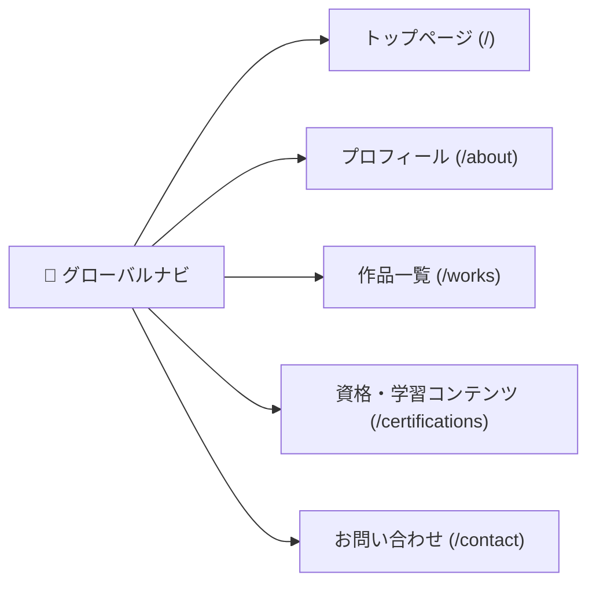

# 画面遷移図

ポートフォリオサイトの画面遷移図叩き台です（Mermaid 記法）。

---

## 画面遷移図

---

## グローバルナビゲーション

グローバルナビゲーションから任意のページへ直接遷移可能です。

---

## 備考・検討事項

- トップページには各セクションへのバナー・カードリンクを設ける
- 詳細ページには「一覧へ戻る」リンクを設ける
- 全ページにグローバルナビゲーションとフッターを配置する
