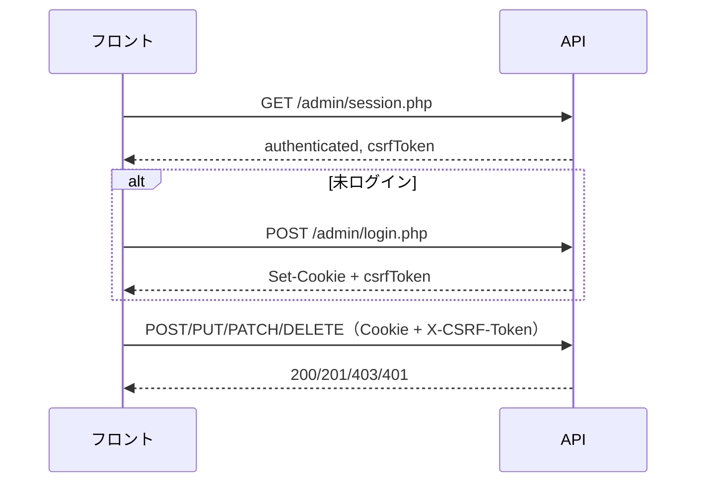

# 認証認可設計テンプレート

> APIの認証・認可に関する基本設計を整理するためのテンプレートです。
>
> 共通仕様: `01_DOCS/wiki/04_API設計/00_共通仕様.md`

---

## 1. 目的

- [ ] この設計書で決める範囲を記載する
- [ ] 公開 API と管理 API の認証方式の違いを明確にする
- [ ] 認証（本人確認）と認可（操作可否）の責務を分けて記載する

---

## 2. API 系統別の認証方式

| 系統 | パス prefix | 認証方式 | 変更系 CSRF | 主な用途 |
|------|-------------|----------|-------------|----------|
| 公開 API | `/api/public/` | **不要** | — | 公開サイト向け読み取り |
| 管理 API | `/api/admin/` | **HttpOnly Cookie** | **必須** | 管理画面 CRUD・PII |

### 2.1 公開 API

- 認証不要
- GET のみ（現状）
- Bearer トークンは **使用しない**（廃止済み）
- `credentials: 'include'` は不要

### 2.2 管理 API

| 項目 | 内容 |
|------|------|
| 認証方式 | HttpOnly セッション Cookie |
| Cookie 名 | `astrohp_admin`（デフォルト） |
| CSRF トークン | `X-CSRF-Token` ヘッダー |
| CSRF 取得元 | `session.php` / `login.php` のレスポンス |
| セッション有効期限 | ブラウザを閉じるまで（`Max-Age=0`） |
| SameSite | `Lax` |
| Secure | HTTPS 時自動（本番は `true` 推奨） |

### 2.3 認証フロー

### 2.4 補足
- [ ] クライアント側は `credentials: 'include'` を全管理 API リクエストに設定する
- [ ] CSRF トークンは JS で保持し、変更系リクエストヘッダーに付与する
- [ ] 再認証条件（セッション切れ → 401）を記載する
- [ ] Bearer トークン・API キーをブラウザに埋め込まない

---

## 3. 認可方針

### 3.1 ロール定義

| ロール | 説明 | 主な権限 |
|--------|------|----------|
| {{ ROLE_1 }} | {{ ROLE_DESC_1 }} | {{ ROLE_PERM_1 }} |
| admin | 管理者 | 管理 API 全操作 |

### 3.2 データ露出の区分

| データ種別 | 公開 API | 管理 API |
|-----------|----------|----------|
| 公開済み changelogs | ✅ | ✅ |
| 未公開 changelogs | ❌ | ✅ |
| PII（email 等） | ❌ | ✅ |
| `is_published`, `created_at` 等 | ❌ | ✅ |

### 3.3 判定ルール
- [ ] 公開 API では `is_published = 1` のみ返却する
- [ ] 管理 API はログイン済み admin のみアクセス可能とする
- [ ] 変更系操作には CSRF トークン検証を必須とする

---

## 4. APIごとの認証・認可マトリクス

| No | 系統 | メソッド | パス | 認証 | CSRF | 備考 |
|----|------|----------|------|------|------|------|
| 1 | public | GET | `/api/public/{{ PATH_1 }}.php` | 不要 | — | {{ NOTE_1 }} |
| 2 | admin | GET | `/api/admin/{{ PATH_2 }}.php` | Cookie | 不要 | {{ NOTE_2 }} |
| 3 | admin | POST | `/api/admin/{{ PATH_3 }}.php` | Cookie | 必要 | {{ NOTE_3 }} |
| 4 | admin | PATCH | `/api/admin/{{ PATH_4 }}.php` | Cookie | 必要 | {{ NOTE_4 }} |
| 5 | admin | DELETE | `/api/admin/{{ PATH_5 }}.php` | Cookie | 必要 | {{ NOTE_5 }} |
| 6 | admin | GET | `/api/admin/session.php` | Cookie | 不要 | 未ログインでも 200 |
| 7 | admin | POST | `/api/admin/login.php` | 不要 | 不要 | |
| 8 | admin | POST | `/api/admin/logout.php` | Cookie | 必要 | |

---

## 5. セキュリティ要件

- [ ] HTTPS 必須化（本番）
- [ ] CORS 設定（本番は具体オリジン、`Access-Control-Allow-Credentials: true`）
- [ ] CSRF 対策（管理 API 変更系）
- [ ] HttpOnly Cookie（XSS 対策）
- [ ] SQL インジェクション対策（プリペアドステートメント）
- [ ] セッション固定化攻撃対策
- [ ] 監査ログの記録範囲
- [ ] レート制限の適用方針（必要に応じて）

### やってはいけないこと

- Bearer トークンをブラウザに埋め込む
- 本番で `CORS_ALLOW_ORIGIN=*` のまま Cookie 認証を使う
- 公開 API 経由で PII を返却する

---

## 6. エラー設計

| ステータスコード | 意味 | 主な発生場面 |
|------------------|------|-------------|
| 401 | 未認証 | 管理 API に Cookie なし、ログイン失敗 |
| 403 | CSRF 不一致 | 変更系で `X-CSRF-Token` 欠落/不一致 |
| 406 | Accept 不正 | Accept ヘッダー未設定・形式不正 |

---

## 7. 運用・管理

- [ ] 管理者アカウントの作成・無効化手順を記載する
- [ ] セッション切れ時のフロント挙動（再ログイン誘導）を記載する
- [ ] 障害時の切り戻し方針を記載する
- [ ] 認証基盤の障害時の挙動を記載する

---

## 8. レビュー観点

- [ ] public / admin の区分が明確である
- [ ] CSRF 必須の操作が漏れていない
- [ ] PII の露出範囲が適切である
- [ ] エラー応答が統一されている
- [ ] CORS / Cookie 設定が環境ごとに妥当である

**最終更新：** {{ UPDATED_AT }}
