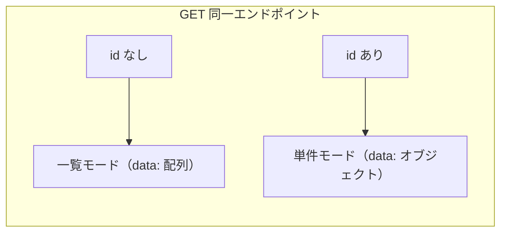

# 管理API単件取得API（管理・横断仕様）

> **本書は横断仕様である。** 単件取得専用の新規エンドポイントは設けず、既存の管理 CRUD エンドポイントの GET に「`id` 指定時は単件モードで返す」挙動を共通定義する。
> 各リソースのフィールド定義は重複させず、対応する CRUD 仕様書の一覧 item を参照する。

## 1. 基本情報

| 項目 | 内容 |
|------|------|
| API名 | 管理API単件取得（横断仕様） |
| メソッド | GET |
| 対象パス | `/api/admin/changelogs.php`, `/api/admin/qualifications.php`, `/api/admin/qualification_statuses.php`, `/api/admin/skill-categories.php`, `/api/admin/skills.php` |
| バージョン | v1（`Accept` ヘッダー指定） |
| 認証 | **セッション Cookie 必須** |
| CSRF | **不要**（読み取りのみ） |
| 概要 | 管理 CRUD エンドポイントの GET において、`?id=N` 指定時に単一レコードを `{ "data": { ... } }` で返す |
| 主な利用画面 | 管理画面（各リソースの編集・詳細表示） |

## 2. 共通仕様への準拠

本 API は `01_DOCS/wiki/04_API設計/00_共通仕様.md` に準拠する。

- `Accept: application/vnd.astrohp+json;version=1` が必須
- 全リクエストに `credentials: 'include'`（Cookie 送信）
- GET（読み取り）には CSRF トークン不要
- エラー形式は RFC7807 互換
- 管理 API はキャッシュしない（`Cache-Control: no-cache, no-store, must-revalidate`）

## 3. 設計方針（一覧と単件の責務分離）

同一 `.php` エンドポイントの GET で、`id` クエリの有無によりモードを切り替える。

| モード | 条件 | レスポンス | pagination |
|--------|------|-----------|------------|
| 一覧 | `id` **未指定** | `{ "data": [...], "pagination": {...} }` | あり（ページングを持つ API のみ） |
| 単件 | `id` **指定** | `{ "data": { ... } }` | なし |



### 一覧 API に id フィルタを持たせない方針

- 一覧モード（配列レスポンス）に、主キー `id` で 1 件へ絞り込むためのクエリパラメータは **設けない**。
- 1 件だけ取得したい場合は、必ず単件モード（`?id=N`、オブジェクトレスポンス）を使う。
- `qualification_statuses.php` の `qualification_id` のような **外部キーによる絞り込み** は一覧の正当なフィルタであり、本方針の対象外（引き続き一覧で提供する）。
- 単件モードでは一覧用クエリ（`page` / `per_page` / `from` / `to` / `category` / `status` 等）は評価しない。

## 4. リクエスト仕様

### 4.1 ヘッダー

| ヘッダー名 | 必須 | 値 | 説明 |
|------------|------|----|------|
| Accept | 必須 | `application/vnd.astrohp+json;version=1` | API バージョン指定 |
| Cookie | 必須 | `astrohp_admin=...` | 管理セッション |

### 4.2 クエリパラメータ

| パラメータ | 型 | 必須 | 制約 | 説明 |
|------------|----|------|------|------|
| id | integer | 必須 | 1 以上の整数 | 取得対象レコードの主キー |

- 単件 GET では `id` は **クエリ `?id=N` のみ**で指定する（JSON body は使わない）。
- `id` の検証は PUT / PATCH / DELETE と同一ロジック（`resolve_id()`、5 章）を共通利用する。

### 4.3 リクエスト例

```
GET /api/admin/changelogs.php?id=1 HTTP/1.1
Host: localhost:8080
Accept: application/vnd.astrohp+json;version=1
Cookie: astrohp_admin=...
```

## 5. id 解決（`resolve_id()`）

クエリ `id` の取得・検証は共通ヘルパー `resolve_id()` に集約する。単件 GET と PUT / PATCH / DELETE で同じ検証・同じ detail メッセージを用いる。

```php
// 想定シグネチャ（詳細は PHP_MySQL実装ガイド.md 参照）
function resolve_id(string $paramName = 'id'): int
```

既存バリデーション文体（`page must be an integer of 1 or greater.`）に揃える。

| 条件 | HTTP | detail |
|------|------|--------|
| `id` 未指定 | 400 | `id is required.` |
| 非整数（`abc` / 小数 / 空文字 等） | 400 | `id must be an integer.` |
| 0 以下 | 400 | `id must be an integer of 1 or greater.` |
| DB に該当レコードなし | 404 | リソース別（7 章。PUT / DELETE と同一メッセージ） |

> 単件 GET では `id` は必須のため、`?id=` を付けない呼び出しは一覧モードとして扱われる。「単件取得のつもりで `id` を付け忘れた」場合に一覧が返る点に注意する（呼び出し側の責務）。

## 6. レスポンス仕様

### 6.1 正常時（200 OK）

`data` は単一オブジェクト。フィールドは **対応する一覧 API の 1 要素と同一スキーマ**とする（7 章の参照元を参照）。

```json
{
  "data": {
    "id": 1,
    "title": "新機能追加",
    "body": "説明文",
    "changed_at": "2025-07-10",
    "is_published": 1,
    "created_at": "2025-06-01 12:00:00",
    "updated_at": "2025-06-01 12:00:00"
  }
}
```

- 一覧モードと異なり `pagination` は付与しない。
- 日付・日時は管理 API の規約どおり DB 値そのまま（`YYYY-MM-DD` / `YYYY-MM-DD HH:mm:ss`）で返す。
- `is_published` 等のフラグは管理 API 規約どおり **0/1 の整数**で返す。

### 6.2 レスポンスヘッダー

| ヘッダー | 値 |
|----------|----|
| Content-Type | `application/json; charset=UTF-8` |
| Cache-Control | `no-cache, no-store, must-revalidate` |
| Pragma | `no-cache` |

> 管理 API にはキャッシュヘッダー（`Cache-Control: public, max-age=...`）を付けない。

## 7. 対象エンドポイント

各リソースの単件レスポンスは、対応する一覧 API の 1 要素と同一スキーマ。404 の detail は既存の PUT / DELETE と一致させる。

| エンドポイント | レスポンス参照元 | 404 detail | 備考 |
|---------------|-----------------|-----------|------|
| `GET /api/admin/changelogs.php?id=N` | [変更履歴管理API.md](変更履歴管理API.md) 3.2 の data item | `Changelog not found.` | 未公開（`is_published=0`）も返す |
| `GET /api/admin/qualifications.php?id=N` | [資格管理API.md](資格管理API.md) 3.1 の data item | `Qualification not found.` | — |
| `GET /api/admin/qualification_statuses.php?id=N` | [資格管理API.md](資格管理API.md) 4.1 の data item | `Qualification status not found.` | `id` は取得状況行の主キー（`qualification_id` ではない） |
| `GET /api/admin/skill-categories.php?id=N` | [スキル管理API.md](スキル管理API.md) 3.1（TODO） | `Skill category not found.` | `subcategories[]` をネストして返す。**サブカテゴリの id 単体取得は対象外** |
| `GET /api/admin/skills.php?id=N` | [スキル管理API.md](スキル管理API.md) 4.1（TODO） | `Skill not found.` | `evidence[]` をネストして返す |

## 8. エラー仕様

| ステータス | 条件 | detail 例 |
|-----------|------|-----------|
| 400 Bad Request | `id` 未指定・非整数・0 以下 | `id must be an integer of 1 or greater.` |
| 401 Unauthorized | Cookie なし・セッション無効 | `Authentication required.` |
| 404 Not Found | 該当 id のレコードなし | `Changelog not found.`（リソース別） |
| 405 Method Not Allowed | GET 以外 | `Method not allowed.` |
| 406 Not Acceptable | Accept ヘッダー不正 | `Unsupported API version.` |
| 500 Internal Server Error | DB 障害等 | `An unexpected error occurred.` |

### 404 例

```json
{
  "type": "about:blank",
  "title": "Not Found",
  "status": 404,
  "detail": "Changelog not found.",
  "instance": "/api/admin/changelogs.php?id=999",
  "traceId": "..."
}
```

### 400 例（不正 id）

```json
{
  "type": "about:blank",
  "title": "Bad Request",
  "status": 400,
  "detail": "id must be an integer of 1 or greater.",
  "instance": "/api/admin/changelogs.php?id=0",
  "traceId": "..."
}
```

## 9. 補足・スコープ外

- **公開 API（`/api/public/`）に同等の単件取得は設けない。** 公開側は一覧 GET のみを提供する。
- `/api/admin/users.php` は一覧取得のみで、単件取得は対象外（[ユーザー一覧取得API.md](ユーザー一覧取得API.md) 参照）。
- `skill_subcategories`（サブカテゴリ）の id 単体取得は **含めない**。サブカテゴリはカテゴリ単件レスポンスの `subcategories[]` として取得する。
- `session.php` / `login.php` / `logout.php` などの認証系は本仕様の対象外（[管理画面認証API.md](管理画面認証API.md) 参照）。
- 旧 URL（`/api/changelogs.php` 等）は使用しない。
