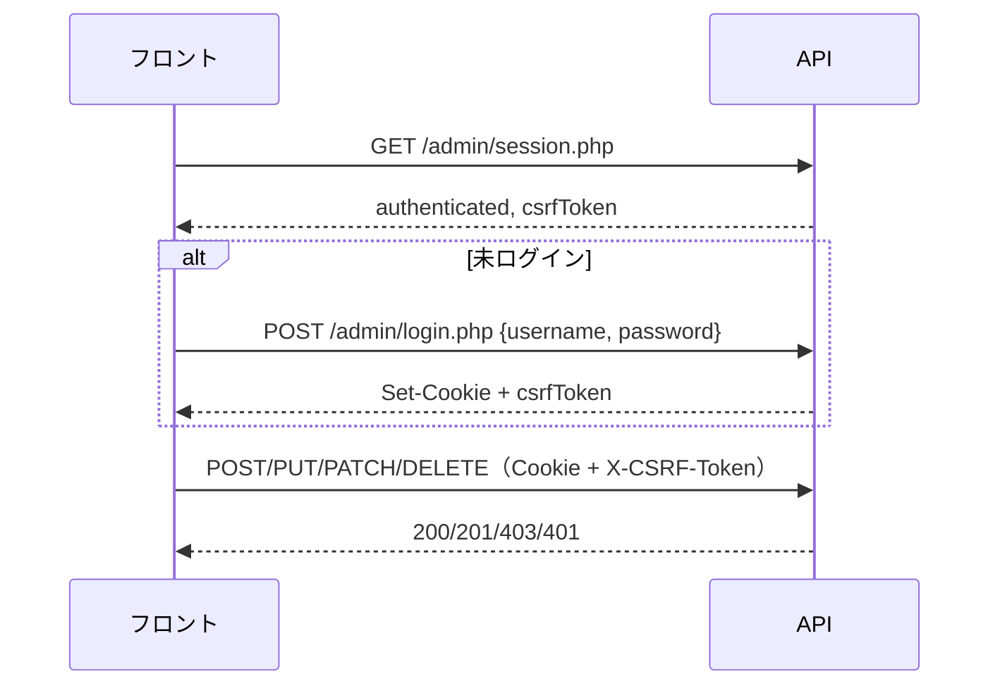

# 管理画面認証API

## 1. 基本情報

| 項目 | 内容 |
|------|------|
| API名 | 管理画面認証API |
| パス | `/api/admin/session.php`, `/api/admin/login.php`, `/api/admin/logout.php` |
| バージョン | v1（`Accept` ヘッダー指定） |
| 認証方式 | **HttpOnly セッション Cookie** + **CSRF トークン** |
| 概要 | 管理画面のログイン・セッション確認・ログアウト |
| 主な利用画面 | 管理画面 |

## 2. 共通仕様への準拠

本 API は `01_DOCS/wiki/04_API設計/00_共通仕様.md` に準拠する。

- 全リクエストに `credentials: 'include'`（Cookie 送受信）
- `Accept: application/vnd.astrohp+json;version=1` が必須
- Bearer トークンは **使用しない**（廃止済み）
- エラー形式は RFC7807 互換

## 3. 認証フロー



### 推奨初期化手順

1. **`GET /api/admin/session.php`** でログイン状態と `csrfToken` を取得
2. 未ログインなら **`POST /api/admin/login.php`**
3. 以降、変更系リクエストに **`X-CSRF-Token`** を付与
4. ログアウトは **`POST /api/admin/logout.php`**（CSRF 必須）

## 4. セッション確認

```
GET /api/admin/session.php
```

### リクエスト

| ヘッダー名 | 必須 | 値 |
|------------|------|-----|
| Accept | 必須 | `application/vnd.astrohp+json;version=1` |

### 正常時（200 OK）

```json
{
  "data": {
    "authenticated": true,
    "admin_id": 1,
    "csrfToken": "<64文字hex>"
  }
}
```

未ログイン時:

```json
{
  "data": {
    "authenticated": false,
    "admin_id": null,
    "csrfToken": null
  }
}
```

- **401 にはならない**（未ログインでも 200 で `authenticated: false` を返す）
- 認証済み時のみ `csrfToken` が返る

## 5. ログイン

```
POST /api/admin/login.php
```

### リクエスト

| ヘッダー名 | 必須 | 値 |
|------------|------|-----|
| Accept | 必須 | `application/vnd.astrohp+json;version=1` |
| Content-Type | 必須 | `application/json` |

**Request body:**

```json
{
  "username": "admin",
  "password": "admin1234"
}
```

### 正常時（200 OK）

```json
{
  "data": {
    "admin_id": 1,
    "csrfToken": "<64文字hex>"
  }
}
```

- 成功時に **HttpOnly Cookie**（デフォルト名: `astrohp_admin`）が `Set-Cookie` される
- `csrfToken` は **レスポンス body にも返る**（JS で保持してヘッダーに付ける）

### エラー

| ステータス | 条件 |
|-----------|------|
| 400 Bad Request | 必須項目不足 |
| 401 Unauthorized | ユーザー名/パスワード不一致 |

## 6. ログアウト

```
POST /api/admin/logout.php
```

### リクエスト

| ヘッダー名 | 必須 | 値 |
|------------|------|-----|
| Accept | 必須 | `application/vnd.astrohp+json;version=1` |
| X-CSRF-Token | 必須 | `<token>` |

### 正常時（200 OK）

```json
{
  "data": {
    "loggedOut": true
  }
}
```

## 7. Cookie / セッション設定

| 項目 | デフォルト |
|------|-----------|
| Cookie 名 | `astrohp_admin` |
| HttpOnly | `true`（JS から読めない） |
| SameSite | `Lax` |
| Secure | HTTPS 時自動（本番は `true` 推奨） |
| 有効期限 | `0` = ブラウザを閉じるまで |

フロントと API が **別オリジン** の場合、SameSite=Lax では POST 等の挙動に注意が必要。可能なら **同一サイト構成**（例: `example.com` と `example.com/api`）が安全。

## 8. CSRF トークン

- ログイン成功時・`session.php`（認証済み時）で取得
- **変更系リクエストごとに `X-CSRF-Token` ヘッダー** で送る
- GET（読み取り）には不要

## 9. エラー仕様

| ステータス | 条件 | detail 例 |
|-----------|------|-----------|
| 400 Bad Request | 必須項目不足 | `username and password are required.` |
| 401 Unauthorized | ログイン失敗、未認証で保護リソースにアクセス | `Invalid credentials.` |
| 403 Forbidden | ログアウト時 CSRF 不一致 | `CSRF token mismatch.` |
| 406 Not Acceptable | Accept ヘッダー不正 | `Unsupported API version.` |
| 500 Internal Server Error | サーバーエラー | `An unexpected error occurred.` |
