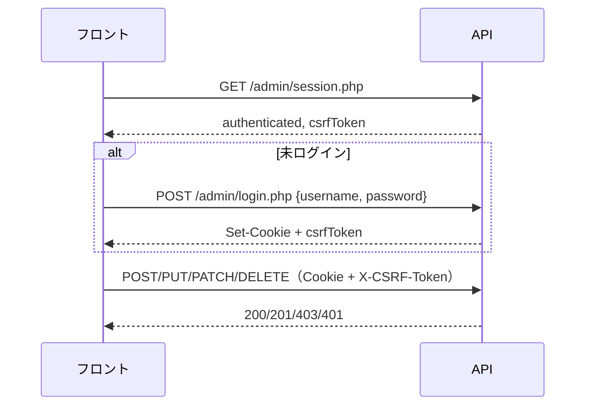

# ブラウザ開発者向け API 利用ガイド

この API は **ポートフォリオサイトのフロント（Astro 等）から直接呼ぶ前提** で設計されています。公開ページ用と管理画面用で **URL・認証方式が分かれている** 点が最重要です。

詳細なエンドポイント仕様は `01_DOCS/04_API設計/02_詳細設計/API仕様書/` 配下の各ドキュメントを参照してください。

---

## 1. ベース URL とエンドポイント構成

| 環境 | ベース URL（例） |
|------|------------------|
| ローカル Docker | `http://localhost:8080/api/` |
| 本番 | `https://<your-domain>/api/` |

エンドポイントは **`.php` ファイル単位** です（REST 風ルーティングではありません）。

```
/api/public/   … 認証不要・読み取り専用（公開サイト向け）
/api/admin/    … 要ログイン・書き込み・PII（管理画面向け）
```

**旧 URL は使わないでください。** 移行時は以下に差し替えが必要です。

| 旧 | 新 |
|----|-----|
| `/api/changelogs.php` | `/api/public/changelogs.php`（公開）または `/api/admin/changelogs.php`（管理） |
| `/api/users.php` | `/api/admin/users.php` |

---

## 2. 全リクエスト共通：必須ヘッダー

### Accept（必須・省略不可）

```
Accept: application/vnd.astrohp+json;version=1
```

- 未指定・形式不正・未対応バージョン → **406 Not Acceptable**
- 現在サポートされているバージョンは **v1 のみ**

### Content-Type（JSON ボディを送るとき）

```
Content-Type: application/json
```

### レスポンス形式

- 成功時: `Content-Type: application/json; charset=UTF-8`
- 一覧系: `{ "data": [...], "pagination": {...} }`
- 単体系: `{ "data": {...} }`

---

## 3. CORS と Cookie 認証

管理 API は **HttpOnly セッション Cookie** を使うため、ブラウザから呼ぶときは次を守る必要があります。

```javascript
fetch(url, {
  credentials: 'include',  // 必須（管理 API）
  headers: {
    Accept: 'application/vnd.astrohp+json;version=1',
    // ...
  },
});
```

| 設定 | 挙動 |
|------|------|
| `CORS_ALLOW_ORIGIN=*`（ローカル） | `Access-Control-Allow-Credentials` は **付かない** |
| 本番（具体オリジン指定） | `Access-Control-Allow-Credentials: true` が付く |

本番では **フロントのオリジンを正確に指定** する必要があります（`*` では Cookie 認証が成立しません）。

許可ヘッダー: `Authorization, Content-Type, Accept, X-CSRF-Token`  
許可メソッド: `GET, POST, PUT, PATCH, DELETE, OPTIONS`  
`OPTIONS` は **204 No Content**（プリフライト用）

---

## 4. API の2系統（どちらを使うか）

### 公開 API（`/api/public/`）

- **認証不要**
- **GET のみ**（現状）
- **公開済みデータのみ**（例: `is_published = 1` の changelogs）
- Bearer トークンは **使わない**（廃止済み）

### 管理 API（`/api/admin/`）

- **セッション Cookie で認証**
- 変更系（POST/PUT/PATCH/DELETE）は **`X-CSRF-Token` 必須**
- PII（email 等）・CRUD 操作はこちらのみ

---

## 5. 管理画面の認証フロー（実装パターン）



### 推奨初期化手順

1. **`GET /api/admin/session.php`** でログイン状態と `csrfToken` を取得
2. 未ログインなら **`POST /api/admin/login.php`**
3. 以降、変更系リクエストに **`X-CSRF-Token`** を付与
4. ログアウトは **`POST /api/admin/logout.php`**（CSRF 必須）

詳細: [管理画面認証API.md](./API仕様書/管理画面認証API.md)

### ログイン

```
POST /api/admin/login.php
```

**Request body:**
```json
{ "username": "admin", "password": "admin1234" }
```

**Success (200):**
```json
{
  "data": {
    "admin_id": 1,
    "csrfToken": "<64文字hex>"
  }
}
```

- 成功時に **HttpOnly Cookie**（デフォルト名: `astrohp_admin`）が Set-Cookie される
- `csrfToken` は **レスポンス body にも返る**（JS で保持してヘッダーに付ける）
- 失敗: `401`（ユーザー名/パスワード不一致）、`400`（必須項目不足）

### セッション確認

```
GET /api/admin/session.php
```

**Response:**
```json
{
  "data": {
    "authenticated": true,
    "admin_id": 1,
    "csrfToken": "<token>"   // 未ログイン時は null
  }
}
```

- **401 にはならない**（未ログインでも 200 で `authenticated: false`）

### ログアウト

```
POST /api/admin/logout.php
Header: X-CSRF-Token: <token>
```

**Response:**
```json
{ "data": { "loggedOut": true } }
```

---

## 6. エンドポイント詳細

### 公開: 変更履歴一覧

```
GET /api/public/changelogs.php
```

詳細: [変更履歴取得API.md](./API仕様書/変更履歴取得API.md)

| クエリ | 型 | デフォルト | 制約 |
|--------|-----|-----------|------|
| `page` | int | `1` | 1 以上 |
| `per_page` | int | `10` | 1〜50 |
| `from` | date | — | `YYYY-MM-DD` |
| `to` | date | — | `YYYY-MM-DD`、`from` より後は不可 |

**Response 例:**
```json
{
  "data": [
    {
      "id": 4,
      "title": "パフォーマンス改善",
      "body": "...",
      "changed_at": "2025-07-10"
    }
  ],
  "pagination": {
    "page": 1,
    "per_page": 10,
    "total": 4,
    "total_pages": 1
  }
}
```

- `is_published`・`created_at` 等は **返らない**
- `Cache-Control: public, max-age=60` が付く（60秒キャッシュ可）
- `credentials: 'include'` は不要

---

### 管理: 変更履歴 CRUD

```
/api/admin/changelogs.php
```

詳細: [変更履歴管理API.md](./API仕様書/変更履歴管理API.md)

| メソッド | 用途 | CSRF |
|---------|------|------|
| GET | 全件（未公開含む） | 不要 |
| POST | 作成 | **必要** |
| PUT / PATCH | 更新 | **必要** |
| DELETE | 削除 | **必要** |

**GET クエリ**（公開 API と似ているが制約が異なる）:

| クエリ | デフォルト | 制約 |
|--------|-----------|------|
| `page` | `1` | 1 以上 |
| `per_page` | **`20`** | 1〜**100** |

**GET レスポンスの各 item:**
```json
{
  "id": 1,
  "title": "...",
  "body": "...",
  "changed_at": "2025-07-10",
  "is_published": 1,
  "created_at": "2025-06-01 12:00:00",
  "updated_at": "2025-06-01 12:00:00"
}
```

`is_published` は **0/1 の整数**（boolean ではない）

**POST 作成（201）:**
```json
{
  "title": "新機能",        // 必須、255文字以内
  "body": "説明",           // 任意（null 可）
  "changed_at": "2025-09-01", // 必須 YYYY-MM-DD
  "is_published": true      // boolean（true/false, 0/1 等）
}
```

**Response:**
```json
{ "data": { "id": 5 } }
```

**PUT/PATCH 更新:**
- `id` は **クエリ `?id=1`** または **JSON body の `id`**
- body は **更新する項目のみ**（部分更新）
- 更新対象フィールドが空 → `400`
- 存在しない id → `404`（値が同じで rowCount=0 の場合も 404 判定あり）

**Response:**
```json
{ "data": { "id": 1, "updated": true } }
```

**DELETE:**
- `id` 指定方法は更新と同じ
- 存在しない → `404`

**Response:**
```json
{ "data": { "id": 1, "deleted": true } }
```

---

### 管理: 単件取得（GET `?id=N`）

詳細: [管理API単件取得API.md](./API仕様書/管理API単件取得API.md)

管理 CRUD エンドポイントの GET は、`?id=N` を付けると **単件モード**（オブジェクト）で 1 件を返します。`id` を付けない場合は従来どおり一覧モード（配列）です。一覧側に主キー `id` で 1 件へ絞り込むクエリは設けません。

```
GET /api/admin/changelogs.php?id=1
```

**Response（200）:**
```json
{ "data": { "id": 1, "title": "...", "is_published": 1 } }
```

- 対象: `changelogs` / `qualifications` / `qualification_statuses` / `skill-categories` / `skills`
- `id` 不正（未指定/非整数/0 以下）→ `400`、該当なし → `404`（PUT/DELETE と同じメッセージ）
- 公開 API（`/api/public/`）には単件取得はありません
- レスポンスは `pagination` を含みません

---

### 管理: ユーザー一覧（PII）

```
GET /api/admin/users.php
```

詳細: [ユーザー一覧取得API.md](./API仕様書/ユーザー一覧取得API.md)

- 要ログイン（Cookie）
- CSRF 不要
- **ページングなし**（最大 100 件、`id ASC`）

**Response:**
```json
{
  "data": [
    { "id": 1, "name": "山田太郎", "email": "yamada@example.com" }
  ]
}
```

---

## 7. エラーレスポンス（RFC 7807 互換）

すべてのエラーは同一形式です。

```json
{
  "type": "about:blank",
  "title": "Bad Request",
  "status": 400,
  "detail": "page must be an integer of 1 or greater.",
  "instance": "/api/public/changelogs.php?page=abc",
  "traceId": "trace-..."
}
```

| HTTP | 意味 | 主な発生場面 |
|------|------|-------------|
| 400 | バリデーションエラー | 不正なクエリ・JSON・必須項目不足 |
| 401 | 未認証 | 管理 API に Cookie なし、ログイン失敗 |
| 403 | CSRF 不一致 | 変更系で `X-CSRF-Token` 欠落/不一致 |
| 404 | リソースなし | 存在しない changelog id |
| 405 | メソッド不許可 | 許可外 HTTP メソッド |
| 406 | Accept 不正 | Accept ヘッダー未設定・形式不正 |
| 500 | サーバーエラー | DB 障害等（詳細は返さない） |

フロント実装では **`response.ok` だけでなく `status` と `detail` を見る** 設計がよいです。

---

## 8. fetch 実装の参考コード

### 公開 API（変更履歴）

```javascript
const API_ACCEPT = 'application/vnd.astrohp+json;version=1';
const BASE = import.meta.env.PUBLIC_API_BASE ?? 'http://localhost:8080/api';

async function fetchPublicChangelogs({ page = 1, perPage = 10, from, to } = {}) {
  const params = new URLSearchParams({ page, per_page: perPage });
  if (from) params.set('from', from);
  if (to) params.set('to', to);

  const res = await fetch(`${BASE}/public/changelogs.php?${params}`, {
    headers: { Accept: API_ACCEPT },
  });

  if (!res.ok) {
    const problem = await res.json();
    throw new Error(problem.detail ?? problem.title);
  }
  return res.json();
}
```

### 管理 API（CSRF 付き mutation）

```javascript
let csrfToken = null;

async function apiAdmin(path, options = {}) {
  const res = await fetch(`${BASE}/admin/${path}`, {
    ...options,
    credentials: 'include',
    headers: {
      Accept: API_ACCEPT,
      'Content-Type': 'application/json',
      ...(csrfToken && options.method && options.method !== 'GET'
        ? { 'X-CSRF-Token': csrfToken }
        : {}),
      ...options.headers,
    },
  });

  if (!res.ok) {
    const problem = await res.json();
    throw new Error(problem.detail ?? problem.title);
  }
  return res.json();
}

// 初期化
async function initAdminSession() {
  const { data } = await apiAdmin('session.php');
  if (data.authenticated) {
    csrfToken = data.csrfToken;
  }
  return data;
}

async function login(username, password) {
  const { data } = await apiAdmin('login.php', {
    method: 'POST',
    body: JSON.stringify({ username, password }),
  });
  csrfToken = data.csrfToken;
  return data;
}
```

---

## 9. 知っておくべき制約・注意点

### やってはいけないこと

- **Bearer トークンをブラウザに埋め込む**（廃止済み。秘密は置けない）
- 公開 API 経由で **email 等の PII を期待する**（管理 API のみ）
- 本番で `CORS_ALLOW_ORIGIN=*` のまま **Cookie 認証を使う**

### Cookie / セッション

| 項目 | デフォルト |
|------|-----------|
| Cookie 名 | `astrohp_admin` |
| HttpOnly | `true`（JS から読めない） |
| SameSite | `Lax` |
| Secure | HTTPS 時自動（本番は `true` 推奨） |
| 有効期限 | `0` = ブラウザを閉じるまで |

フロントと API が **別オリジン** の場合、SameSite=Lax では POST 等の挙動に注意が必要です。可能なら **同一サイト構成**（例: `example.com` と `example.com/api`）が安全です。

### CSRF トークン

- ログイン成功時・`session.php`（認証済み時）で取得
- **変更系リクエストごとに `X-CSRF-Token` ヘッダー** で送る
- GET（読み取り）には不要

### バリデーションの細かい点

- 日付は **`YYYY-MM-DD` のみ**（時刻不可）
- `title` は空文字不可、最大 255 文字（マルチバイト文字数）
- `is_published` は JSON boolean として送る（`true`/`false`）
- JSON body が空・不正 → `400`
- DELETE も **JSON body で `id` を渡す** 想定（クエリでも可）

### キャッシュ

- 公開 changelogs のみ `max-age=60`
- 管理 API にはキャッシュヘッダーなし → 通常はキャッシュしない

---

## 10. フロント側の環境変数（推奨）

```env
PUBLIC_API_BASE=https://your-domain.com/api
```

開発時:

```env
PUBLIC_API_BASE=http://localhost:8080/api
```

Accept ヘッダーのサービス名は `astrohp` 固定（サーバー側 `API_SERVICE_NAME` と一致させる）。

---

## 11. チェックリスト（実装前）

- [ ] 公開ページは `/api/public/` のみ使用
- [ ] 管理画面は `credentials: 'include'` を全リクエストに設定
- [ ] 全リクエストに `Accept: application/vnd.astrohp+json;version=1`
- [ ] 画面初期化で `session.php` を呼び CSRF を確保
- [ ] POST/PUT/PATCH/DELETE に `X-CSRF-Token` を付与
- [ ] 406/401/403 を UI に反映（特にセッション切れ → 再ログイン誘導）
- [ ] 旧 `/api/changelogs.php` 等への参照を削除済み
- [ ] 本番 CORS がフロントの具体オリジンになっている

---

## 関連ドキュメント

| ドキュメント | 内容 |
|-------------|------|
| [00_共通仕様.md](../../wiki/04_API設計/00_共通仕様.md) | API 共通仕様 |
| [管理API単件取得API.md](./API仕様書/管理API単件取得API.md) | 管理 GET 単件取得（横断仕様） |
| [変更履歴取得API.md](./API仕様書/変更履歴取得API.md) | 公開 changelogs GET |
| [変更履歴管理API.md](./API仕様書/変更履歴管理API.md) | 管理 changelogs CRUD |
| [管理画面認証API.md](./API仕様書/管理画面認証API.md) | login / session / logout |
| [ユーザー一覧取得API.md](./API仕様書/ユーザー一覧取得API.md) | 管理 users GET |
